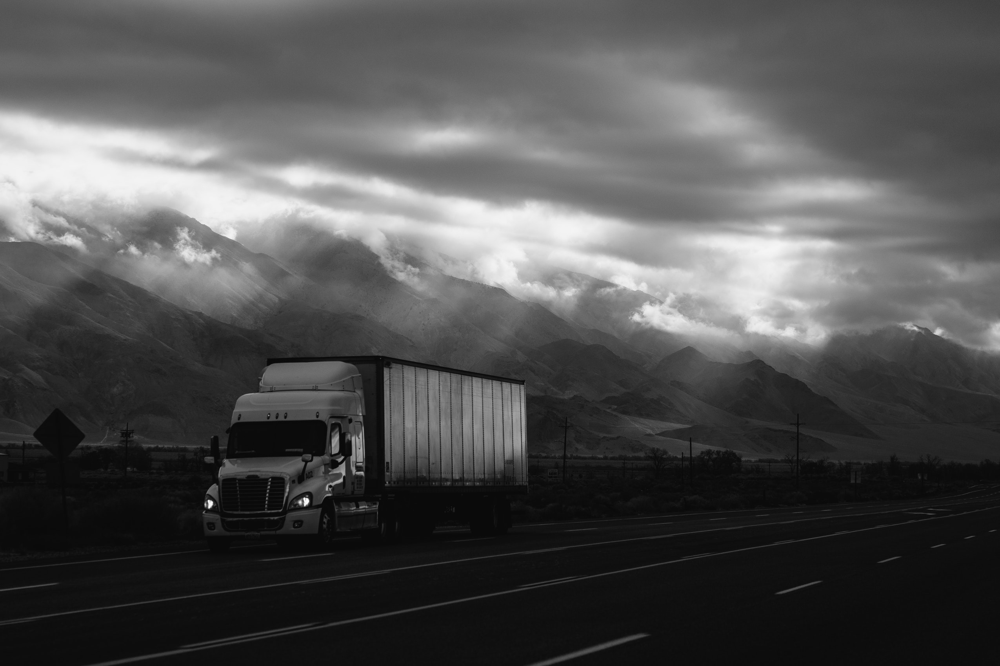

:100: I was thinking the other day about when I started as a diesel tech and all the questions I had. Do you need a CDL as a diesel mechanic? I had a struggle with this when I first started working as a mechanic trainee I was not even old enough to get a CDL. I wasn't sure and really never got a great answer. 

### In short, No. I would say that most diesel mechanics don't have a CDL. While a CDL will make you more of an asset to a shop it is usually not required. Now let's look into this a little further. Should you get it anyway? 

### Do you have to have a CDL? No. Would it benefit you? Yes.

While it is not required a CDL can open doors for you. It can help your resume for sure. It is always nice for a manager to have another person who can test drive the trucks after they are finished. It also shows that you are committed to the field. 

###Now not all diesel mechanics work on over the road trucks 
but, chances are you will have the opportunity or even have to drive a large service vehicle in your career. While I worked on fire apparatus you did not technically half to have the CDL but, the city I worked for required it. 

### Should I get it myself or wait and let a company pay for it?

This one is tough. I was lucky enough to work for a place that had a trainer and I was able to get mine and get paid for it. Not everyone is so lucky and if you are just getting into the field you may not want to invest the resources into this. If your company if willing to foot the bill to me this is a not brainer. 

If you are thinking of going it on your own and getting it I think it will help you. I suggest studying and knocking out the learners quickly. I have seen people drag it out way to long. Just go get it done. If your working for a company with no program. Ask! You never know and your boss might appreciate the initiative. Overall a CDL is not required for a diesel mechanic but, it is beneficial. 
