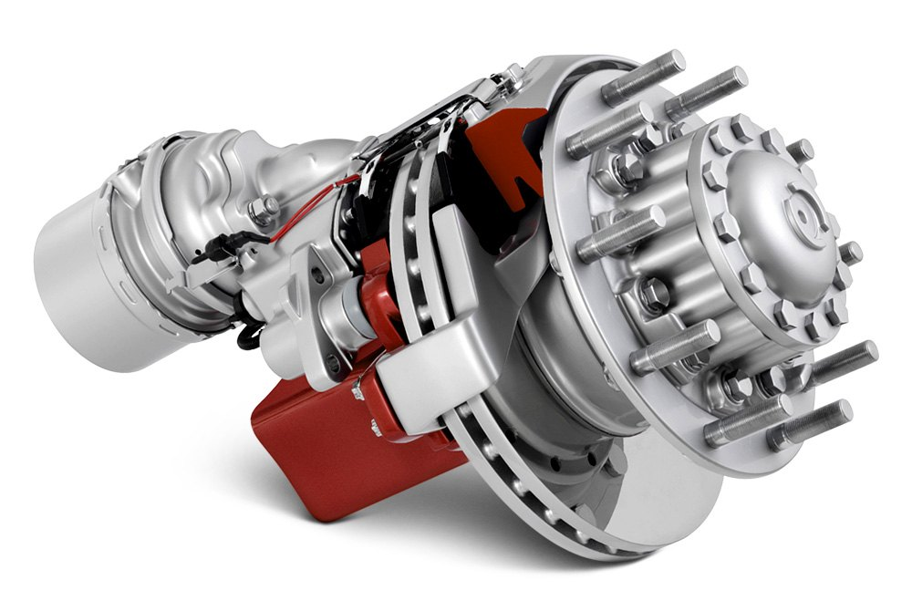
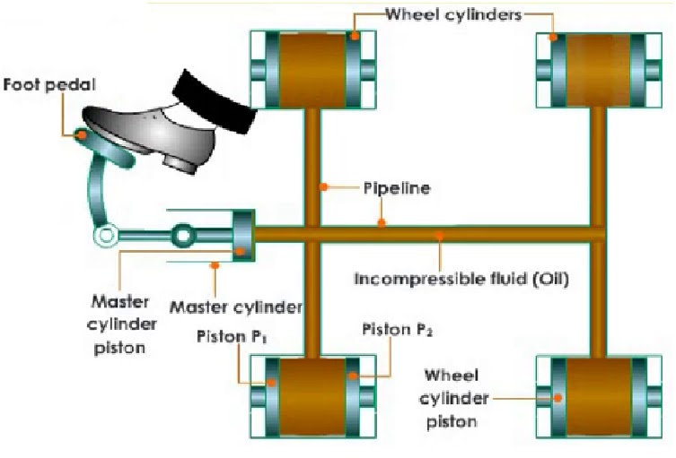
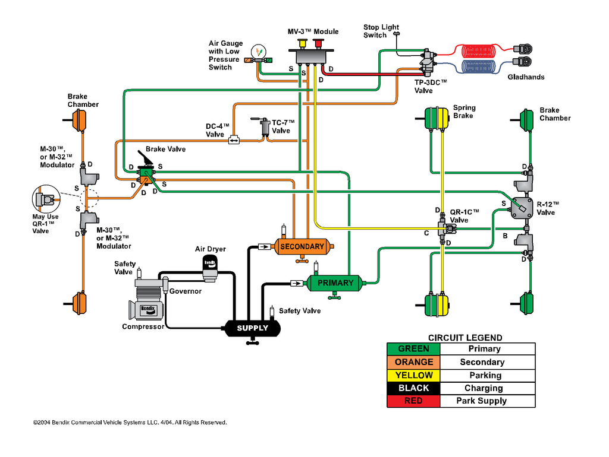
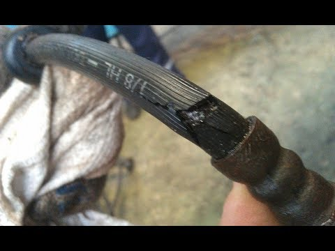

After a few hours looking for a slow air leak you can begin to wonder, are air brakes better? If you are new to Diesels or heavy truck or maybe you are moving over from car or equipment mechanics they can be confusing and you can begin to wonder if they are worth it. Let's answer that. 

**Yes, especially is heavy applications. Hydraulic brakes simply cannot supply the energy needed to stop large equipment. That is not the only reason. There are other benefits to using air brakes over hydraulics. First, let's see the differences and then we will look at the benefits of air brakes**

##Understanding Hydraulic Brakes

###How Hydraulic Brakes Work

- Hydraulic brakes use fluid to charge the brakes. When the driver presses the brake pedal, the hydraulic fluid pressure increases to the point that it forces the brake pistons at each wheel to push the brake pad against the rotor or drum causing friction, slowing the wheels, and, eventually, stopping the vehicle.

"The technology [for hydraulic brakes] is very similar to that used by passenger cars," said Tony Moore, director, brake and safety systems for Freightliner Trucks. "The difference is that the components are much larger to handle the higher weight ratings."

####Vehicle weight for Hydraulic Brakes

A maximum gross vehicle weight rating (GVWR) of 33,000 pounds. In most cases, hydraulic brakes are used on trucks up to 26,000-pounds GVWR.

####Applications for Hydraulic Brakes 

"We recommend using hydraulic brakes in lighter GVWRs where the duty cycle is not too severe," Moore advised. "Applications, such as van delivery trucks, are a good example of recommended hydraulic brake application. Hydraulic brakes do very well in stop-and-go applications where the vehicle speed is not too great. One problem with hydraulic brakes is that they are sometimes pushed beyond their capacity, resulting in greatly reduced performance."

Todd Kaufman, F-Series chassis cab marketing manager for Ford Motor Company, draws the line between hydraulic and air brakes based on a truck's duty cycle, stops per day, and payload requirements. He notes, "In the lighter applications from 19,501 to 26,000 pounds, hydraulic brakes do well to serve the market. You might even stretch it as high as 29,000 pounds; but, usually, when going above 26,000 pounds loads are substantially heavier, which may overload the hydraulic brakes, causing them to wear sooner and diminish stopping performance."

##Understanding Air Brakes

###How Air Brakes Work

- Instead of using fluid, air brakes, as the name implies, use air to provide stopping energy. When the air tanks are fully pressurized, the brakes are **disengaged**. When the driver presses the brake pedal, air fills the brake chamber, pushing the chamber diaphragm, which turns the S-cam, and then pushes the brake pads against the brake drum or rotor,stopping the vehicle. Then, when the brake pedal retracts, the air is released allowing the brakes to release and the wheels to roll. The compressor pumps air causing the system to return to it's original state.

####Vehicle weight for Air Brakes

Air brakes work on trucks 26,000 to 33,000 pounds and larger. "While hydraulic brakes are standard on our Class 5 and Class 6 vehicles and air brakes on Class 7 and greater, we do allow a crossover where air brakes can be installed on lighter vehicles [under 33,000-pounds GVWR]," Moore said.

####Applications for Air Brakes

Moore recommends air brakes for heavy vocational applications and noted they should always be used in heavy towing applications.

A significant reason why air brakes are preferred in heavier trucks (above 26,000-pounds GVWR), compared to hydraulic systems, is their robust stopping power when they work - and when they fail. For example, if there's a leak in the brake line of an hydraulic system, fluid pressure can lower to the point where there isn't sufficient force on the brake pads to create the friction needed to slow the wheel.

Eventually, if the leak is not repaired, the truck can lose braking power in that portion of the system, reducing the ability to stop in the same distance. With air brakes, the opposite happens. If there is a leak in the air brake lines, the air pressure decreases, which actually activates the brakes at the wheels and brings the vehicle to a safe stop.

However, air brakes come at a premium price. According to Kaufman of Ford, the air brake system costs approximately $2,500 more than hydraulic brakes, because of the extra components to operate the system.

"When you compress air, you have moisture, and you have to get rid of that moisture so you're adding air dryers as part of the initial purchase. But, if you're going to keep the vehicle for more than five years - maintenance costs tend to go more vertical after year five and get really expensive. After that, I think air brakes pay for themselves," he said.

Another factor with air brakes is how they impact a fleet's available driver pool. Even if the truck is under 26,000-pounds GVWR, which would normally not require a commercial driver's license (CDL) to operate, if it is equipped with air brakes, the driver may have to carry a CDL, depending on the state's laws, which limits the number of drivers qualified to operate the truck.

"Air brakes, for lack of a better description, are either 'on' or they are 'off.' If you've never driven an air brake truck, the first few times you press the brake, you feel like you're putting yourself through the windshield. Unlike hydraulic brakes, which modulate more intuitively, the operator has a lot to do with actively modulating the air brakes to make the stopping process smoother. That's something the driver learns," Kaufman noted.

# Two main benefits of Air Brakes

## 1. Safety 

One of the biggest benefit of air brakes is they cannot fail. Unlike hydraulic brakes, air brake do not use a fluid for compression. The supply of air is unlimited, so the brake system can never run out of fluid. Minor leaks do not result in brake failures.

If someone cuts your brake lines on your car the brake fluid drains out and you **have no brakes**. 

Unlike hydraulic brakes, air brakes when there is a leak the brakes apply. When there is no air the brakes are fully applied. That way there is no chance of a run away heavy vehicle. That is not to say it **can't** happen. It is just unlikely because if a line were to brake and leak all the air our the brakes apply. Not always what you want but, safer than losing all brakes. That is the logic behind this. 🛑 *Stop* is better than *can't stop* 🛑 

Air brakes are also effective even with a considerable leak, so an air brake system can be designed with sufficient **fail-safe** capacity to stop the vehicle safely even when leaking.

## 2. Maintenance

You may not know it but, air brakes also have a great advantage in the area of maintenance. There are several reasons for this. 

- First, air line couplings are easier to attach and detach than hydraulic lines. You can snatch one off into no time and the best part there is no mess. Hydraulic fluid is a mess. It gets everywhere and everything and then your at home having a sandwich. What's that taste? You guessed it, hydraulic fluid(I prefer a 2015 DOT 3 🍷).

- Second, the risk of air getting into hydraulic fluid is eliminated, as is the need to bleed brakes when they are serviced. Pumping brakes alone if a tough gig. Can be seriously frustrating and take quite a bit of time. Have a friend helping? Worse 😆. With air brakes depending on whether your drum or disc set up you just run the adjustment all the way down and then back it off per the manufacture specs. Simple.

- Third, air brake circuits on trailers can be easily attached and removed. This takes away that pain point of trailer brakes. It's no trouble to add a trailer and have the same superior braking power unlike hydraulic where they are often electric or non-existent. 

Damage will happen no matter what braking technology you have. With air brakes we see that not only are the repairs more strait forward with less mess but, also, regular maintenance is easier. 

****

##To Sum Up

Air brakes just have more stopping power and are used on the heavier applications. They have some benefits over hydraulics but, are more expensive. As a diesel mechanic you will have the change to work on both systems so, it is important to have a good grasp on the concepts and how they are different. 
