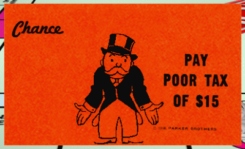

So, you are looking at jobs. You see a company that says it pays flat rate to its mechanics. Is that a deal? What is flat rate? Do all mechanics make flat rate? Let's dive into that.

Do diesel mechanics make flat rate? **No. Most diesel mechanics are payed hourly. There may be exceptions but, the majority are not flat rate. Flat rate is usually given at dealerships and other small "car" shops. Let's look at what flat rate is, why it sucks and why you should never work anywhere that has that pay structure.**

Flat rate work stinks. O, wait... let me tell you what flat rate is first. 

## What is flat rate?

Flat rate pay is when a mechanic is paid by the number of hours **billed** (or book hours) of a job regardless of how long it takes them. So, for example, you have a set of brakes that the book says take 2 hours to replace. That is how many hours you get paid to do the job. No matter whether it actually takes 15 minutes or 15 hours. 

Most people in the industry agree that flat rate pay is a huge rip off for the mechanic. Let me give you 5 reasons why. 

## 5 reasons flat rate pay sucks

1. **Employer wins every time**

Flat rate requires no risk for your employer. **Bully for them!** In good business there is what is called a win, win, win. The business wins, the employee wins and the customer wins. The business makes a profit, the employee makes a fair wage and the customer gets the service at a fair price. The flat rate model is a win for the business for sure not for the employee. When you get stuck and have trouble with a job you eat those hours. You do not get paid for any extra work or thought about the customer. 

2. **Favoritism**

If you looked at this article and thought "whatever I think it's great" it's because you are the lucky one who gets all the high paying jobs. We talk about you behind your back 😆. I'm sure you just love the service manager that much that you buy his lunch daily. 

Favoritism is one of the big problems with flat rate. Who gets the best paying jobs? The best mechanic? The one with the most seniority? In some cases, but more often the guy who is "in" with the boss. While the new guy is struggling to get 30 paid hours the other guy is racking up 80.

3. **Slow days**

One of my best friends worked for a dealership for many years. I would often go by and complain with him about how he was being ripped off. On slow days we would sit in his bay and chat for a couple hours while he was not getting paid. He was required to be there **50 hours** a week. He often only turned in 30 - 40 hours of work. So where did that other time go? could he go home for those hours...Nope. He was stuck there with the hopes of another vehicle rolling in. 

4. **Wear on your body**

With knowing that you can make hardly nothing on those slow days you really have to hustle on the busy days. There are days when you can work 10 hours and bill 15. You are going to be running hard. Especially if you have kids to feed. All that stress and hustle does not play kindly to your body. Consider this, the [Mayo Clinic](https://www.mayoclinic.org/healthy-lifestyle/stress-management/in-depth/stress-symptoms/art-20050987) lists these symptoms of stress. Common effects of stress are: 
- On your body: Headache, Muscle tension or pain, Chest pain, Change in sex drive, Upset Stomach, Sleep problems	
- On your mood: Lack of motivation, Feeling overwhelmed, Sadness or depression, Anxiety	
Don't take years of your life. Find a hourly job wear you work with a team. 

5. **Speed kills** 

 Mechanic work is not easy work anyway and when you try to go fast mistakes are made, injuries happen, and knuckles are smashed. When you feel like you wage is totally dependent on your speed you can't help but try to hurry through things. This inevitably adds to the stress and you miss things which ultimately cause you to take longer on jobs. It is a viscous cycle. 

 ****

 ##To sum up
If you get anything from this article, I hope it is **your worth more than that**. You need to look at the factors when considering a job and the pay scale. Don't be so happy that anyone wants to hire you that you fall into one of these kinds of jobs. There is something better out there for you. Just be patient. If you are in a flat rate job don't stay! 🏃‍♂️Don't waste any more time. I don't care of the shop manager said next year you will have a 30-hour minimum it's still not worth it. Remember who the real winner is in the pay structure. Value yourself! Find a fair company. Someone you *really* want to work for and then go after it with all you got. Good luck!  