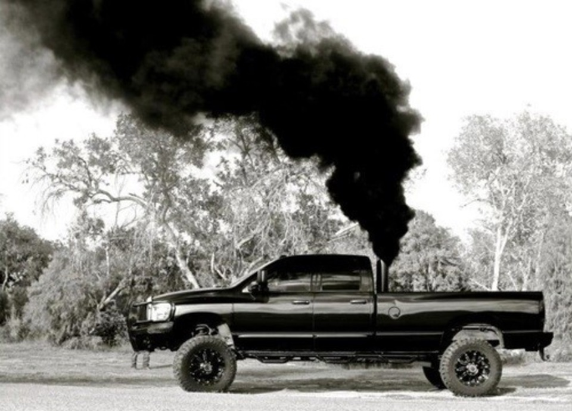
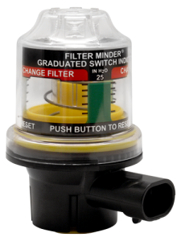
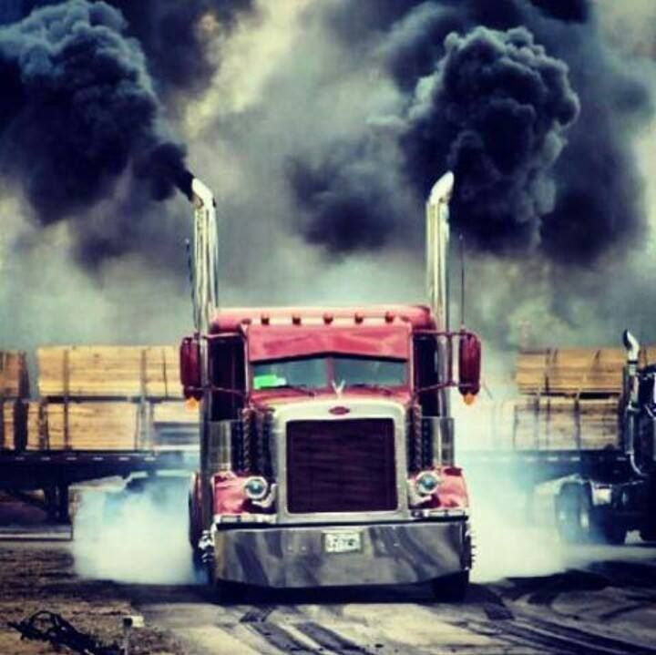

So, you have some black smoke billowing out of your exhaust. Otherwise known as "rolling coal". Nothing more fun to a diesel guy than seeing a Prius with the windows down and blowing a bunch of black smoke that way. Diesels are known for blowing black smoke during acceleration but, is that bad? Is it a sign of trouble? What causes black smoke? Let's answer those questions and more.    

What does Black smoke from a diesel engine mean? **Black smoke occurs when partially burned fuel passes through the combustion chamber. Normally, an engine burns fuel completely and emits water and CO2. Black smoke indicates that something is causing the fuel to only burn partially. It is an air/fuel mixture problem** 

Whether or not is bad for your engine depends on what the cause of the black smoke is. **A little black smoke is normal on a properly functioning diesel engine**, but if the amount of smoke changes at different RPM and loads you have an issue. Here are the things it could be and then we will go into what to look for and steps to diagnose the problem... 

##Causes of black smoke (In no particular order)
* Incorrect timing
* Dirty, worn or malfunctioning injectors
* Over-fueling
* Faulty turbocharger 
* Incorrect valve clearance
* Incorrect air/fuel ratio
* Low cylinder compression 
* Dirty air cleaner
* Restricted induction system
* Carbon in intake manifolds
* Incorrect engine tune
* Poor quality fuel
* Excessive carbon builds up in combustion chamber
* Cool operating temperatures

##Let's start as always with the most likely problems first 🕵️‍

## Air Restriction 

There is a delicate mixture of air and fuel that needs to be achieved in order to have a clean burn from your diesel engine. When you are having black smoke, the balance has not happened. **Air restriction is the most common cause of black smoke.** So, where is the restriction? 

**1. Air filter**

How dirty is it? When is the last time you opened it up and looked at it? Sometimes there is what is called a "air minder". 

It is an indicator for your air filter and should be changed when it reaches a specified mark. That could be it! and a majority of the time this is the problem. 

**2. Inlet restriction**

Check your inlet pipping. Is one collapsed? Look for anything abnormal in the hosing. Run the engine while you are looking as a weak hose may suck together when operating. What about that missing shop rag 🧐. Anyway, you get the idea. Look for obstructions to air freely flowing into the engine intake.  

**3. Leaks or damage around or in the turbocharger**

Look at all the piping around the turbocharger and intercooler. Listen when the engine is under a load and sometimes it will squeal and let you know that there is a leak somewhere. Tighten all the connections. They can always use a little quarter turn. Listen for abnormal noise from the turbo itself. When you have the hose removed give the turbine and wiggle. It should have only a small amount of 'play'.  

**4. Exhaust or DPF damaged**

Inspect the entire exhaust and DPF system. Look for any crushed or damaged parts. Look at the muffler if it's under the vehicle. It is easy to damage when you have a driver who likes running over things.

**5. Sensor faults**

Modern engines have control units that actively measure air mass and make appropriate adjustments. You could have a sensor giving bad information to the module. 

##Fuel or Tune

**1. Poor Driving**

You are going to see this in manual transmission vehicles. If the gear is too high for load and the driver attempts to just give it more fuel the engine will inject more diesel and there will not be enough air for the engine to burn the diesel fully. This doesn’t mean that the engine is malfunctioning; it just means that the driver needs training.

**2. Bad Fuel**

Check your fuel quality. Bad fuel can cause all sorts of issues. Be careful where you fuel up and pay attention as best as you can to the fuel you are putting in. It is no fun draining tanks. A great place to check fuel quality is to drain your fuel filter. Note: kerosene emits black smoke

**3. Bad tune**

Has your fancy tune betrayed you? You may just need to reset your tune if you are not intending to black out everyone at every stop light. Maybe you lost power and it reverted to an incorrect tune. Worth looking into if you are having issues. 

##Mechanical Issues (So much for the easy stuff)

**1. Injector timing**

It could be that your injector timing needs adjusting. 

**2. EGR issues**

Look at the specific steps to inspect and test your EGR system. Make sure the EGR valve doesn’t need to be replaced.

**3. Faulty injectors**

Dirty, sticking or leaking injectors. Common rail injectors staying open for too long giving the engine too much fuel. One thing you can do to determine this is measure the temperature of the exhaust manifold at each cylinder. You are looking for cooler temperatures in certain cylinders to indicate the fuel is passing through unburnt. 

**4. Incorrect Valve Lash**

This can happen when you have had damage in the top of the engine or a recent repair where the overhead was ran. This can be indicated by a "rattle" 👂under the valve cover. It is easy enough to pop the cover off and have a look. 

**5. Cylinder problems**

Worn or sticking rings can cause low cylinder compression, excessive carbon built up in combustion chamber can all be the cause. This can be indicated by excessive blow-by. 
Diesel engines are prone to this over time because they typically run for longer periods of time and diesel fuel doesn’t include any detergent from the refinery. This can be avoided by adding a [detergent additive (Links to Amazon)](https://www.amazon.com/gp/product/B077VVDPZ4/ref=as_li_tl?ie=UTF8&camp=1789&creative=9325&creativeASIN=B077VVDPZ4&linkCode=as2&tag=learndiesels-20&linkId=a9537320aad552ead114ef3acf4f015e) to your diesel fuel on a regular basis. 

**6. Incorrect pistons**

It's on here because I have seen it first-hand. Continuous black smoke and just could not diagnosis it. Turns out the company we bought a short block from had installed the incorrect pistons. Go figure.  

***Note: Some systems are intentionally set up with chip/programs to blow black smoke on demand. While this is not recommended it will not necessarily hurt any of your engine components and can be fun if that's your thing.***

****
##Summing up

Black smoke can be difficult to diagnose but, if you follow the signs and look at the simple things first you can get to your answer fairly quickly. As with any repair be careful to think about what's going on before you act. The damages that can occur from the problems denoted by blue smoke can be catastrophic but, if you can catch it early you can likely avoid even more costly repairs. Have questions about [white smoke](../the-causes-of-white-smoke-from-a-diesel-and-what-to-look-for) or [blue smoke](../the-causes-of-blue-smoke-from-a-diesel-and-what-to-look-for)? Click the links to read those articles.  

***See something I missed? Help me make it better, comment below. Thanks!***

##Related Questions

####Does Black Smoke Cause poor fuel economy?

Yes. If you are having black smoke as mentioned in this article, it is caused by a poor air/fuel mixture. Too much fuel or too much air will cause poor fuel economy. Your engine needs the right mixture in order to achieve a clean burn and produce the intended amount of power. If your blowing black smoke, it does not mean more power, it means more wasted fuel.

####Black smoke from diesel engine when starting

If this is a modern engine you likely have an injector problem. On older engines this can happen. On older or worn engines blow smoke when the turbo is still spooling up because the amount of air has to catch up to the amount of diesel being injected. 

####My diesel has random puffs of black smoke

I would say this is caused by turbocharger Lag. If you have a large turbocharger this can happen when there is an acceleration from a stop. Larger turbochargers that take more time to “spool up”.  While this is happening, the engine will be “rolling coal” waiting for the turbocharger to get up to speed. Fuel is injected into an engine that is turning at low RPM. It is possible to prevent this by adding a [combustion catalyst (Links to Amazon)](https://www.amazon.com/gp/product/B000LNEGEM/ref=as_li_tl?ie=UTF8&camp=1789&creative=9325&creativeASIN=B000LNEGEM&linkCode=as2&tag=learndiesels-20&linkId=a717dca02d6ffc2d462916bb511ea323) to the fuel to improve the amount of that diesel burned at low RPM.