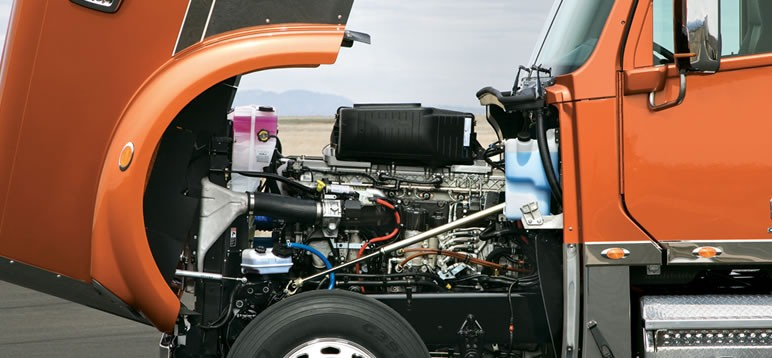
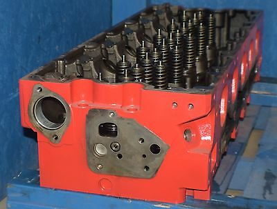
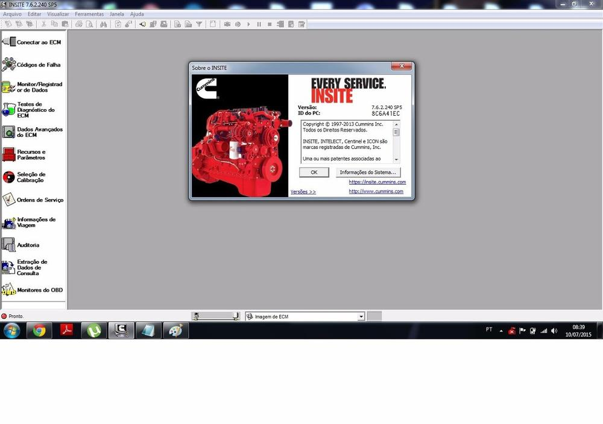

It is easy to think when you look at a diesel engine in a big truck or train that they would be very difficult to work on. Just the sheer size of the parts can scare some from even trying to get into the field.  

 Are diesels easier to work on? **Yes, particularly in industrial applications. Things are designed with maintenance in mind. In general, diesel engines are less complicated and require less tooling. Components are usually easier to reach and therefore make replacing parts and regular maintenance simpler.**

 Don't believe me yet? Let's look at the top 4 reasons Diesels are easier to work on.

 ##1. They are made to work on

Ever started working on a car and thought, "why did they put that there?" Have you ever had to remove half the engine to get the part you need? Cars are made to look pretty. 🚗 Not so much for your semi-truck or fire apparatus. While small diesel cars and trucks are smashed into a small space, when you get into the industrial side diesels there is a vast improvement in the area with which you have to work. I am not saying it is always that easy but the majority of the time, when you open the hood you can see the part you are having issues with.

This is not the case for VWs or European diesel trucks and cars. A lot of the time they can be even more crammed than a gas car. Sometimes you can really see tight spots around turbos or batteries, but for the majority of diesel engines, they will be placed in large workable areas.

 ##2. Larger and easier to see

In the same vain, the parts can be easier to spot and see work. For instance, you are having an issue with a turbo wastegate. Well you can hook up and operate the wastegate via the diagnostic software and watch it move. Another great example is removing a valve cover. On a car it is most of the time difficult and you can't see the rear of the valves/cylinder. On a diesel, for the most part, you can get right in there. Most diesels have a reusable rubber gasket on the valve cover as well.

When you watch a car run with the valve cover off things can be hard to see. With a diesel most of the time you are going to have so much more space to get in there a see. Sometimes with the tiny components of a car you can't really see what is going on. When the injector is literally 10 inches long you can inspect the smaller pieces without a magnifying glass.

 ##3. No spark or igniter needed

So, you may have heard that diesels don't have spark plugs, they use glow pugs. This is no accurate. **Not all diesels have glow plugs.** and ***glow plugs do not do the same thing as spark plugs*** Let's get that out of the way first. Glow plugs are usually limited to smaller diesels. They are used to heat up the air inside the combustion chamber before ignition. Not the cause the engine to fire like a spark plug. Not having an ignition system removes an entire area of the engine from having to be diagnosed or considered.

 

 Why do diesels not need spark plugs? The higher compression of Diesel engine makes the need for an ignition system not necessary. Let's Keep in mind the foundational principals when it comes the Diesel engines; they compress atmospheric gas 2 to 3 times higher than engines running on gasoline/petrol. This makes a high temperature inside the combustion chamber. Then,  atomized fuel is injected creating the burn and the force to push the piston down. A Diesel engine can use many different types of fuels. It was actually the inventor of the Diesel engine, Rudolph Diesel, who had the goal of them running on vegetable oil. It was a cheap and abundant source of fuel at that time

 ##4. Great diagnostic software

One of the other great benefits of the diesel engine is the diagnostic tools we have access to. This could be argued but, I believe they are far superior to what is offered to cars. I know that some diesels like the Power-stroke or Duramax will be using the software from their companies but, if you compare those to Cummins Insite or Caterpillar ET they are nowhere near as helpful and user friendly.

 

 Diagnostic software is a huge part of what a diesel mechanic does these days. You need a firm grasp on computers and technology really no matter what field you enter, but especially mechanics. The ease of use with this software can make such a difference in your daily work that it just makes life easier. Cummins Insite is just a pleasure to work with. I have some experience with Ford IDS and others and it just not the same.

****

##Summing up

If you are thinking of buying a diesel or becoming a diesel mechanic, rest assured that it is a great decision. The parts are just bigger. Don't let the size intimidate you. It is a simple concept that will just take a while to master but, totally doable. You can do this!  

##Related Questions

####Do Diesel mechanics make more?

Yes, About 10,000 more a year according to The [U.S. Bureau of Labor Statistics](https://www.bls.gov/ooh/installation-maintenance-and-repair/diesel-service-technicians-and-mechanics.htm). I have personal experience and that number seems to be right on point. Diesel mechanics is not only an easier job but, also in high demand. There are not enough trained Diesel techs out there for the market. I have seen wages steadily rise over the last ten years.