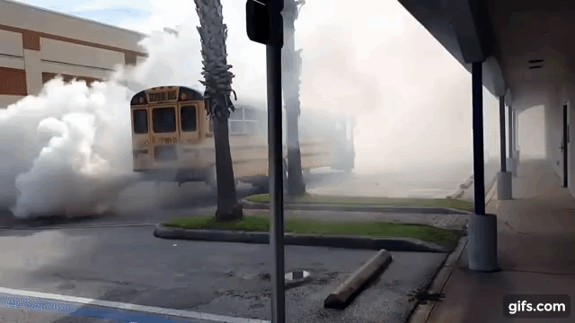

So, you have some white smoke billowing out of your exhaust. What is the cause. Maybe your like me and have to look it up every time. No shame here. This is the complete guide to white smoke from a diesel.   

**White smoke occurs in three scenarios 1. Raw diesel comes through the exhaust completely unburned 2. Water entering combustion chamber. 3. Deposits around piston rings or cylinder glazing. Here is how to tell the difference...** 

## 1. White smoke on a cold start, and then it disappears as the engine warms up

This is very common. It will happen often at startup in cold weather with lower compression engines. As you start running the engine at idle (around 650 or 750 rpm) you will achieve a more effective compression ratio and the smoke clears. White smoke has a lot to do with the temperature in the combustion chamber. 

***If the smoke is really just a puff there is not much to worry about. Especially if it has been sitting. It could just be built up condensation.***

If it lasts a few minutes after the engine is started and there is a **rich diesel smell 👃** they may be some cause for concern. Some of the likely causes include,

- Faulty injectors - stuck open
- Worn piston rings or cylinder glazing
- If equipped with glow plugs could be faulty plugs or module

Remember, if you have an older engine with really low compression and bad timing or low injection pressure, you are more likely to have white smoke.

##2. A thick cloud a white smoke

Red alert 🚨 This is the danger zone. Water or coolant can cause white smoke from a diesel as well. This is a symptom of a bad problem. You are getting coolant or water in the combustion chamber and If you know anything about compressing water you know this is no going to end well. Spoiler - water does not compress. So, if you have this problem be careful running it for any period of time. Once your sure its water stop and fix it. 

This will be a steady stream a smoke after start up. Usually you will see the smoke will be a "thick" smoke (Like in the gif at the top of the page). It will also be noted by a sweet 🍫 smell. Some likely causes include, 

- Blown head gasket 
- Cracked block or head
- Contaminated fuel

Remember, significant damage wil occur if you run the engine with water in the combustion chamber. 

##3. Continuous "light" white smoke

In order to run correctly, a diesel engine needs precise timing of the injector pump and proper pressure. Any decrease in the pressure or delay in the delivery of the fuel to the combustion chamber will cause an incomplete combustion and you will have white smoke.

This is a steady stream of a lighter white smoke. Can even be a random but, often "puff". Some likely causes include,

- A clogged fuel filter
- Low pressure in the fuel pump (Air in the fuel)
- Faulty or damaged injectors
- Incorrect injection timing (Worn timing gear or damaged crankshaft keyway).
- Low cylinder compression (caused by leaking or broken valves, piston ring sticking, cylinder ring wear, or cylinder glaze)

##***Important note for modern diesel engines***

**Modern diesels are designed to deliberately to over-fuel the engine (or just one cylinder) for brief periods in order to create heat to burn carbon off of the Diesel Particulate Filter or DPF. If this over-fuelling is not operating properly it can cause white smoke and damage to the engine.**

****

##Summing up

White smoke can be difficult to diagnose but, if you follow the signs and look at the simple things first you can get to your answer fairly quickly. As with any repair be carful to think about whats going on before you act. The damages that can occur from the problems denoted by white smoke can be catastrophic but, if you can catch it early you can likely avoid even more costly repairs.  